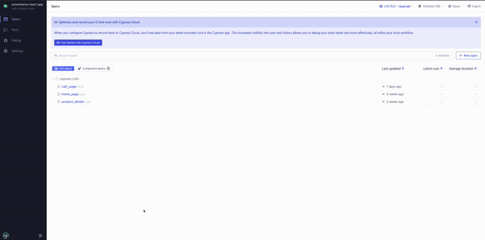

# E-commerce Store Project Showcase

This project serves as a practical demonstration of QA engineering practices using a basic e-commerce application structure. The simplified store implementation includes a basic database and API endpoints, providing a foundation for showcasing:

1. Full-stack Development:

- Backend development using Python and Flask
- Frontend development using JavaScript and React
- Database using SQLite


2. Quality Assurance:

- API design and testing
- End-to-end (E2E) testing
- Implementation of CI/CD practices
- Containerized with Docker

By building both the frontend and backend myself, this project illustrates not only my QA expertise but also a deep understanding of software development principles and practices. This combination of skills allows for more effective testing strategies and bug prevention, as I understand the entire application stack.

## Tech Stack

- Backend: Python, Flask
- Frontend: JavaScript, React
- Database: SQLAlchemy
- API Testing: Postman
- E2E Testing: Cypress
- CI/CD: GitHub Actions

## Installation and Setup

1. Clone the repository

```
git clone https://github.com/megb023/ecommerce-react-app.git
cd ecommerce-react-app
```
1. Set up the backend:

```
cd ecommerce-backend
python -m venv venv
source venv/bin/activate # On Windows use `venv\Scripts\activate`
pip install -r requirements.txt
flask run
```
3. Set up the frontend:

```
cd ecommerce-frontend
npm install
npm start
```

## Running Tests (From Root Directory)
### API Tests (Postman)
1. Import the Postman collection from api-tests/StoreCartTest.json
2. Run the collection in Postman

or

```
npm install -g newman
newman run api-tests/StoreCartTest.json
```

### E2E Tests (Cypress)
1. Ensure the application is running locally
2. Run Cypress tests:
```
npm install cypress --save-dev
npm run cypress:run
```
## CI/CD Workflow
This project uses GiHub Actions for CI/CD, automatically trigger on:
- Push to main branch
- Pull requests to main branch

The full workflow config can be found int .github/workflows/ci-cd.yml

## Key Testing Scenarios

### E2E Tests (Cypress)

1. Homepage test
- Verification of homepage loading and header
- Product grid display and content validation
- Product info display (titles, prices)
- Navigation functionality between pages

2. Product Detail Test
- Product info consistency between listing and detail pages
- Quantity selection functionality
  - Increment/decrement buttons
  - Minimum quantity validation (can't go below 0)
  - Manual quantity input
  - Add to Cart button quantity reflection and navigation validation

3. Cart Management Test
- Empty cart state validation
- Adding items with specific quantities
- Price calculations
  - Indiviudual item totals
  - Cart total verification
- Cart persistence across sesstions
- Multiple items management
  - Adding multiple items
  - Updating quantities
  - Removing individual items
- Check button visibility and navigation

### API Testing (Postman/Newman)

- Cart operations endpoint testing
- Error handling validation
- Response format verification
- Status code validation

### Test Demonstrations
#### Product Detail Test Example - Cypress


#### CI/CD Workflow (Click badge to see all runs)
[](https://github.com/megb023/ecommerce-react-app/actions)


